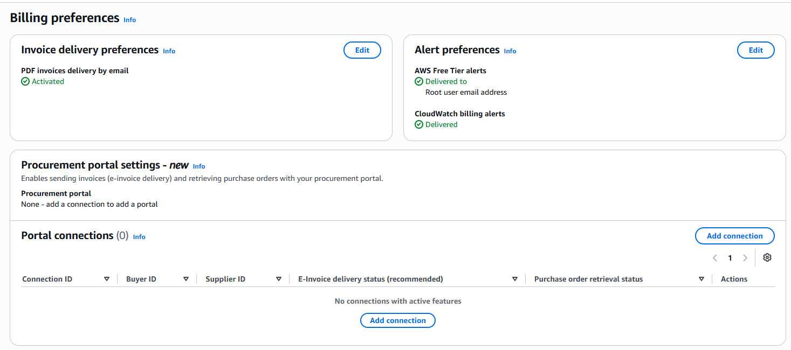
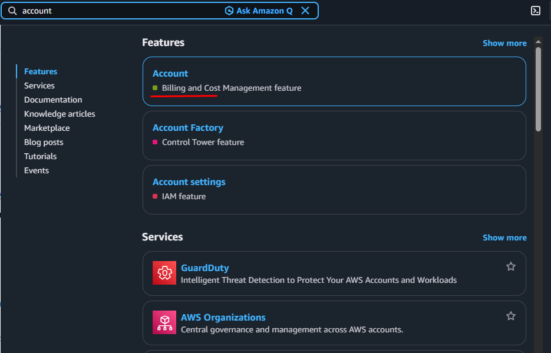
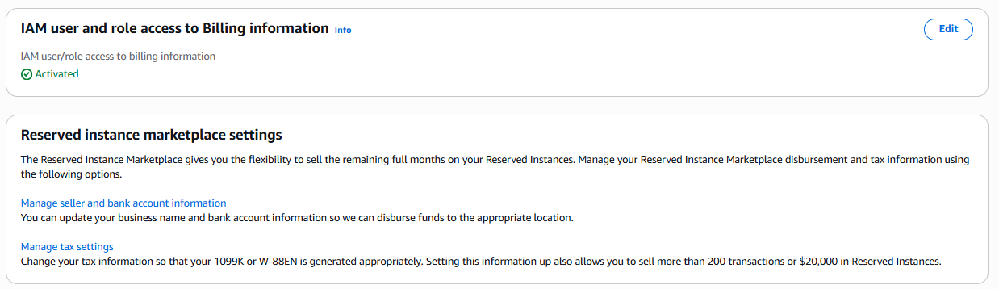
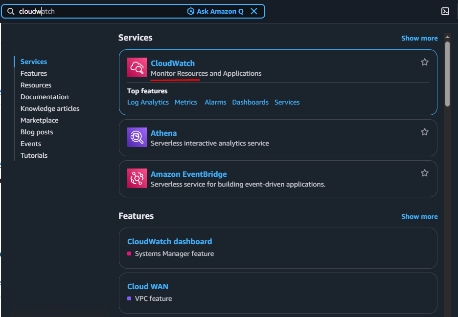
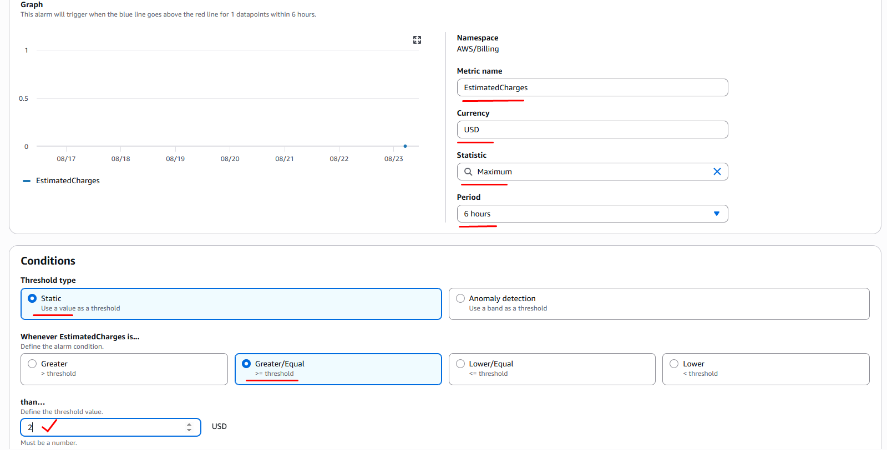
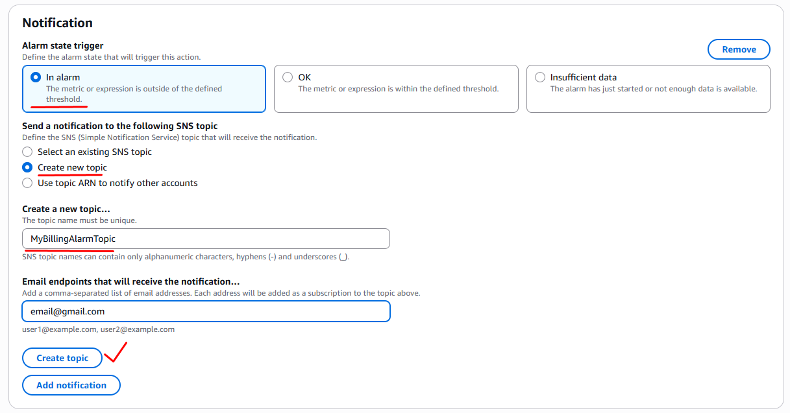
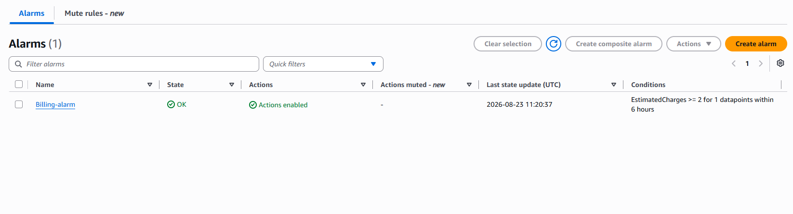

## AWS Billing: 

To set up an AWS billing alarm, first enable billing alerts in your **AWS Billing Console**, switch your region to United States **us-east-1 (N. Virginia)**, and create a metric alarm in **Amazon CloudWatch** tracking Total Estimated Charge. 

### Step 1: Enable Billing Preferences

1. Open the [CloudWatch Console](https://us-east-1.console.aws.amazon.com/console/home?region=us-east-1) in the **us-east-1 (N. Virginia)** region.
    - Go to AWS `Billing and Cost Management` console. 
    - Choose `Billing preferences` in the left menu under `Preferences and Settings`. 
    - Click Edit under `Invoice delivery preferences` : 
        - check ✅ **PDF invoices delivered by email** 
        - click Update.
    - Click Edit under `Alert preferences` : 
        - check ✅ **Receive AWS Free Tier alerts** 
        - check ✅ **Receive CloudWatch Billing Alerts** 
        - click Update.
    - Save your preferences (allow 15-30 minutes for metrics to initialize).

  

2. Go to AWS `Account` console. 
    - Go under the page and click Edit under `IAM user and role access to Billing information`:
        - check ✅ **Activate IAM Access** 
        - click Update. 

### Step 2: Create CloudWatch Alarm

1. Go to AWS `CloudWatch` console. 
    - Choose `Alarms` in the left menu and click `Create alarm`. 
    - Data source: 
        - Select ✅ Metric 
    - Type: 
        - Choose ✅ Classic
    - Metric:
        - Click `Select metric`
        - Select `Billing`  
        - Select `Total Estimated Charge`
        - Currency Choose `USD`
        - Again Click `Select metric`
    - Conditions: 
        - Threshold type: `Static` 
        - Whenever EstimatedCharges is...: `Greater/Equal` 
        - than…: `2 USD` (Dollar limit)
    - Next 
    - Notification
        - Alarm state trigger:
            - ✅ In alarm 
        - Send a notification to the following **SNS topic**
            - ✅ Create new topic
        - Create a new topic…:
            - `MyBillingAlarmTopic`
        - Email endpoints that will receive the notification…
            - `email@gmail.com`    (<- Confirm subscription required)
            - click `Create topic`
    - Next 
    - Add alarm details:
        - Alarm name: `Billing-alarm` 
    - Next 
    - Preview and create
    - click `Create alarm`

   

   

  

  

---
---

