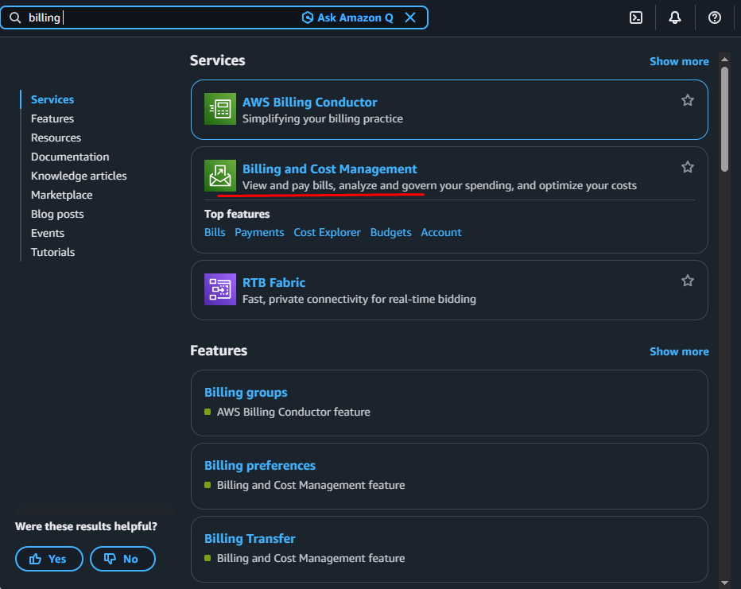
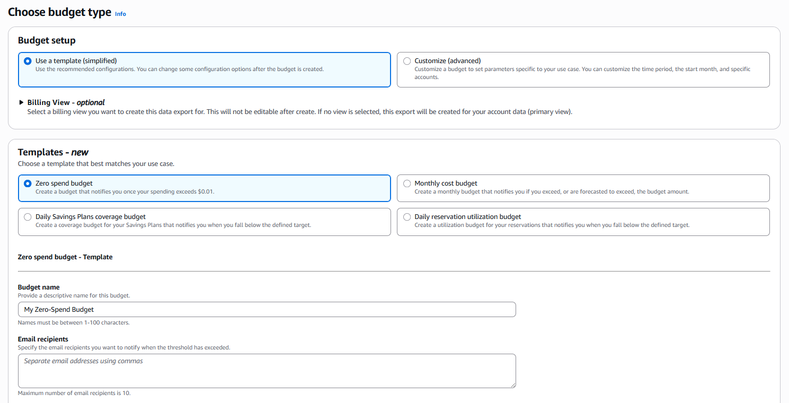
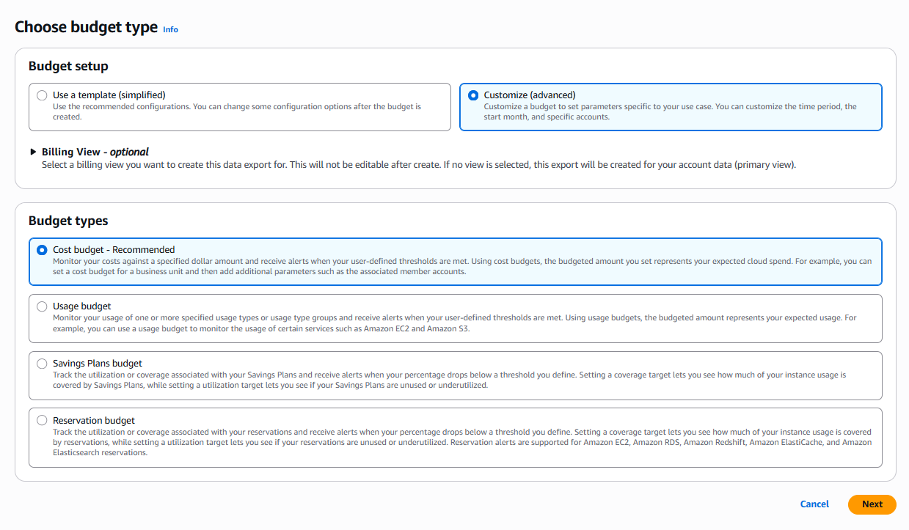
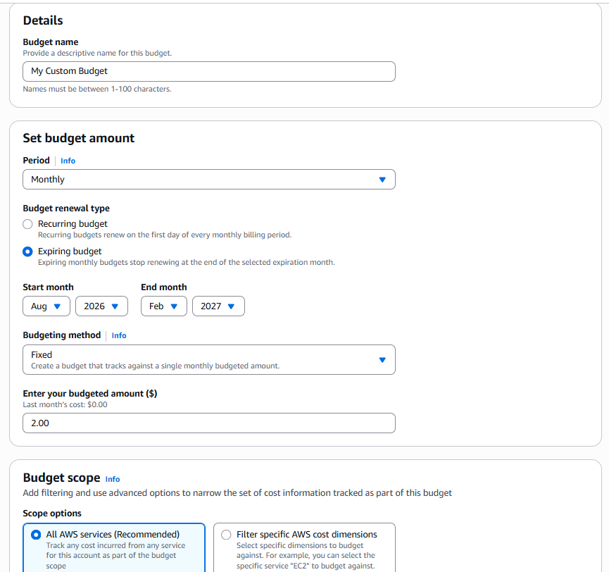
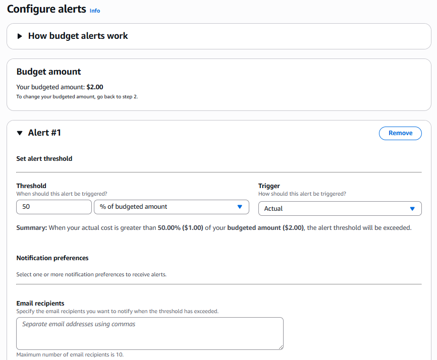

## AWS Budget (Zero spend budget):

To set up an AWS Budget, open the AWS `Billing and Cost Management` console, go to **Budgets**, click **Create budget**, choose a template or advanced options, set your cost limits and alert thresholds, and save the configuration.

---
---

## Set Up a Budget (for Simplified)

1. Open the [CloudWatch Console](https://us-east-1.console.aws.amazon.com/console/home?region=us-east-1) in the **us-east-1 (N. Virginia)** region.
    - Go to AWS `Billing and Cost Management` console. 
    - Select `Budgets` from the left navigation pane under the `Budgets and Planning`. 
    - Click `Create a budget` : 
    - Choose budget type:
        - Budget setup:
            - check ✅ **Use a template (simplified)** (like a zero-spend free tier alert) or **Customize (advanced)** for precise cost or usage limits.
        - Templates - new:
            - check ✅ **Zero spend budget** 
        - Budget name: My Zero-Spend Budget
        - Email recipients: mail@gmail.com
    - Click `Create budget`

  

  

---
---

## Set Up a Budget (for Advanced):

1. Open the [CloudWatch Console](https://us-east-1.console.aws.amazon.com/console/home?region=us-east-1) in the **us-east-1 (N. Virginia)** region.
    - Go to AWS `Billing and Cost Management` console. 
    - Select `Budgets` from the left navigation pane under the `Budgets and Planning`. 
    - Click `Create budget` : 
    - Choose budget type:
        - Budget setup:
            - check ✅ **Customize (advanced)** 
        - Budget types:
            - check ✅ **Cost budget - Recommended** 
        - Next 
        - Budget name: My Custom Budget
        - Set budget amount:
            - Period: `Monthly` 
            - Budget renewal type: ✅ `Expiring budget` 
            - Start month: `Aug / 2026 - Feb / 2027` 
            - Budgeting method: `Fixed`
            - Enter your budgeted amount ($): `2.00`
        - Budget scope:
            - Scope options: ✅ `All AWS services (Recommended)`
            - Advanced options: 
        - Next
        - Configure alerts:
            - Budget amount: Your budgeted amount: `$2.00`
            - Click `Add an alert threshold`:
                - Threshold: `50 % of budgeted amount`
                - Trigger: `Actual` 
                - Email recipients: email@gmail.com
        - Next
        - Attach actions - Optional:
            - **Alert #1**:
                - Click `Add action` (If need)
        - Next
        - Review 
        - Click `Create budget`

  

  

  

---
---

