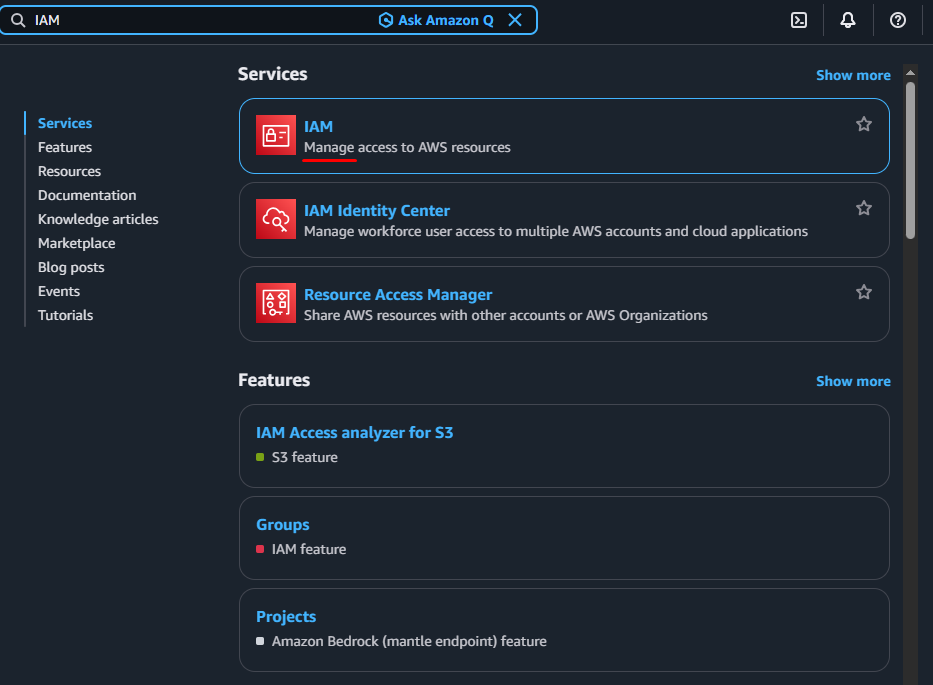

## AWS IAM: 

Setting up **AWS Identity and Access Management (IAM)** is critical for securing your cloud resources. AWS strongly recommends that you stop using your root account for daily tasks and instead set up proper IAM entities.


### Identity Center vs. Standard IAM Users:

| Feature | AWS IAM Identity Center (Recommended) | Standard IAM Users (Legacy) | 
| ------- | ------------------------------------- | --------------------------- | 
| Login Point | One uniform portal link across all company AWS accounts. | Dedicated account-specific URLs. |
| Credential Safety | Temporary credentials that automatically expire. | Long-lived access keys that must be manually rotated. | 
| External Integrations | Native connection to Okta, Microsoft Entra ID, or Google Workspace. | Requires custom SAML 2.0 or OIDC federation setups. | 
| Best Used For | Multi-account configurations and human worker sign-ins. | Legacy software workloads and emergency "break-glass" entry accounts. | 


---
---


## Set Up Standard IAM Users and Groups:

1. Open the **AWS IAM Console**.

2. Create an **IAM Group**: Click `IAM user Groups` in the left menu - click `Create Group`:
    - Name the group: `Admins`
    - Add users to the group - Optional (0):
    - Attach permissions policies - Optional:
        - Search and check ✅ `AdministratorAccess`. 
        - Click `Create user group`.

3. Create an **IAM User**: Click `IAM Users` - click `Create user`. 
    - User details
        - User name: `tech-admin`
        - ✅ Provide user access to the AWS Management Console - optional
        - Console password: 
            - Custom password: `your-password`
    - Next 

4. **Add User to Group**: (On the permissions page)
    - User groups: select `Admins` (Add user to group you just created)
    - Next 
    - Review and create: 
    - Click `Create User`.

5. **Download Credentials**: Save the custom console sign-in URL and temporary password generated on the final confirmation page.


  


---
---


## Create AWS Access Key:

To set up an AWS access key, you must generate the credentials in the AWS IAM Console and then configure them on your local machine using the AWS CLI.


1. Open the **AWS IAM Console**. (Security Note: Always create keys for an IAM User with least-privilege permissions, never for your root account).

2. In the left navigation pane: Click `IAM Users` 

3. Click the specific **User name** you want to create keys for.

4. Select the `Security credentials` tab.

5. Scroll down to the` Access keys` section and click `Create access key`.

6. Choose your Use case: (Check the confirmation box)
    - Select ✅ Command Line Interface (CLI) 
    - Confirmation
        - ✅ I understand the above recommendation and want to proceed to create an access key.
    - click Next 
    - Description tag value: 
    - Click `Create access key`

7. Click `Download .csv file` to save your **Access key ID** and **Secret access key**.
    - Click `Done`


---
---


## Install AWS CLI:

```
curl "https://awscli.amazonaws.com/awscli-exe-linux-x86_64.zip" -o "awscliv2.zip"
```


```
unzip awscliv2.zip

./aws/install
```


```
aws --version
```


### Method A: Configure AWS CLI (Recommended) 

The terminal will prompt you to enter the following information one by one:
- AWS Access Key ID: Paste your downloaded Access Key ID.
- AWS Secret Access Key: Paste your downloaded Secret Access Key.
- Default region name: Enter your primary AWS region (e.g., `us-east-1` or `eu-west-1`).
- Default output format: Enter your preferred format (e.g., `json`, `yaml`, or `text`).


_Configure:_
```
aws configure


AWS Access Key ID [None]: 
AWS Secret Access Key [None]: 
Default region name [None]: us-east-1
Default output format [None]: json
```


```
aws configure list

NAME       : VALUE                    : TYPE             : LOCATION
profile    : <not set>                : None             : None
access_key : ****************STGL     : shared-credentials-file :
secret_key : ****************0HNo     : shared-credentials-file :
region     : us-east-1                : config-file      : ~/.aws/config
```


_Verify:_
```
aws iam list-users

aws iam list-groups

aws s3 ls

aws ec2 describe-availability-zones
```


### Method B: Setting Environment Variables (Temporary Setup)

If you only need the credentials for a single terminal session, you can `export` them directly into your environment:

```bash
## Linux / macOS: 
export AWS_ACCESS_KEY_ID=your_access_key_id
export AWS_SECRET_ACCESS_KEY=your_secret_access_key
export AWS_DEFAULT_REGION=us-east-1
```


---
---


## CloudShell: 

AWS CloudShell requires zero configuration or local installation to set up. Because it is a browser-based terminal that comes pre-authenticated with the credentials you used to log into the AWS Management Console, you can launch it and start running commands immediately.


### Launching AWS CloudShell: 
1. Sign in to the **AWS Management Console** using an IAM user or role with permissions to access CloudShell.
2. Click the **CloudShell icon** (a small terminal prompt symbol `>_`) on the top navigation bar.
3. Alternatively, type **CloudShell** into the main console search bar and select it.


---
---

