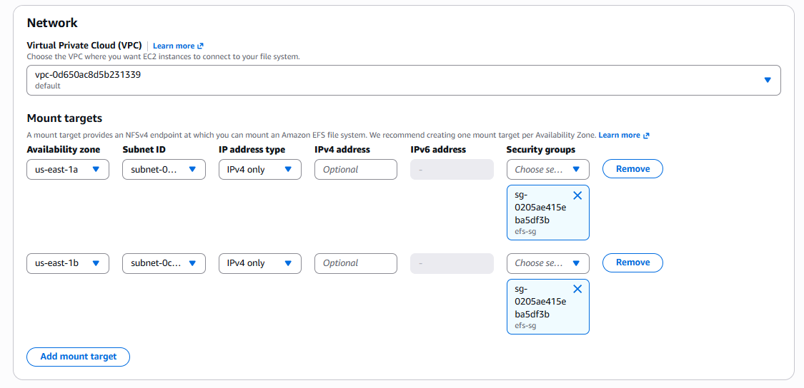

## AWS EFS:

Amazon Elastic File System (EFS) is a managed, scalable NFS file system that can be mounted simultaneously on multiple EC2 instances. It is commonly used when multiple servers need access to the same shared files.


### EFS Features:
- Fully Managed: AWS manages the underlying storage infrastructure.
- Elastic Scaling: EFS automatically grows and shrinks as your data changes.
- Shared File Storage: Multiple EC2 instances can mount the same EFS file system simultaneously.
- Regional Availability: An EFS file system is regional and can be accessed from multiple Availability Zones within an AWS Region.
- Multiple Availability Zones: You can create EFS Mount Targets in multiple Availability Zones.
- NFS Support: EFS uses the NFSv4 protocol, primarily NFSv4.1.
- Lifecycle Management 
- Performance Modes
- Throughput Modes
- Encryption


### Basic architecture: 

```
                    AWS Region
                        |
              +---------+---------+
              |                   |
           AZ-1a               AZ-1b
              |                   |
          EC2-Server-1        EC2-Server-2
              |                   |
              +--------+----------+
                       |
                    EFS File
                    System
                       |
                Shared Storage
```


### Prerequisites:

You need:
- AWS VPC
- At least one EC2 instance
- Security Group
- EFS file system
- EFS Mount Target
- NFS port `2049` allowed between EC2 and EFS


---
---


## Setup EFS: 


### Create Security Group for EC2:

1. Open the [CloudWatch Console](https://us-east-1.console.aws.amazon.com/console/home?region=us-east-1) in the **us-east-1 (N. Virginia)** region.
    - Open the **EC2 Console**.
    - Select `Security Groups` from the left menu under `Network & Security` section, and click `Create security group`: 
        - Security group name: `ec2-sg`
        - Description: 
        - VPC: `(default)`
        - **Inbound rules**:
            - Type:       SSH
            - Protocol:   TCP
            - Port:       22
            - Source:     Anywhere IPv4 
        - Click `Create security group` 


### Create Security Group for EFS: 

1. Open the [CloudWatch Console](https://us-east-1.console.aws.amazon.com/console/home?region=us-east-1) in the **us-east-1 (N. Virginia)** region.
    - Open the **EC2 Console**.
    - Select `Security Groups` from the left menu under `Network & Security` section, and click `Create security group`: 
        - Security group name: `efs-sg`
        - Description: 
        - VPC: `(default)`
        - **Inbound rules**:
            - Type:       NFS
            - Protocol:   TCP
            - Port:       2049
            - Source:     `Custom`
                - **Security Groups**: select `ec2-sg`
        - Click `Create security group` 


### Launch EC2 Instance-01

1. Launch your instance· 

2. Configure your instance:  
    - Number of instances: `1`
    - Name and tags: `web-server-01`
    - Amazon Machine Image (AMI): `Amazon Linux 2023`
    - Instance type: `t3.micro` 
    - Key pair name (required): `technbd-key`
    - Network settings:
        - Network: select VPC `(default)`
        - Subnet: 
        - Availability Zone: `us-east-1a`  (<-- Different AZ)
        - Auto-assign public IP: `Enable`
        - Firewall (security groups): select existing security group (`ec2-sg`)
    - Configure storage: `1x 8 GiB - gp3` (Root volume,3000 IOPS, Not encrypted)
    - Advanced details: 
        - User data - optional: below the data 
    - Then, `Launch instance`


### Launch EC2 Instance-02

1. Launch your instance· 

2. Configure your instance:  
    - Number of instances: `1`
    - Name and tags: `web-server-02`
    - Amazon Machine Image (AMI): `Amazon Linux 2023`
    - Instance type: `t3.micro` 
    - Key pair name (required): `technbd-key`
    - Network settings:
        - Network: select VPC `(default)`
        - Subnet: 
        - Availability Zone: `us-east-1b`   (<-- Different AZ)
        - Auto-assign public IP: `Enable`
        - Firewall (security groups): select existing security group (`ec2-sg`)
    - Configure storage: `1x 8 GiB - gp3` (Root volume,3000 IOPS, Not encrypted)
    - Advanced details: 
        - User data - optional: below the data 
    - Then, `Launch instance`


### Create the EFS File System:

1. Open the Amazon **EFS Console** and click `Create file system`:
    - Name - optional: `efs-share`
    - Virtual Private Cloud (VPC): `(default)`
    - click `Customize`:
        - File system type: ✅ `Regional`  (<-- for high availability across multiple Availability Zones)
        - Automatic backups: N/A (Enable automatic backups)
        - Lifecycle management:
            - Transition into Infrequent Access (IA): 30 days since last access
            - Transition into Archive: 90 days since last access
            - Transition into Standard: None 
        - Encryption: ✅ Enable encryption of data at rest
        - Performance settings:
            - Throughput mode: ✅ `Enhanced` 
            - ✅ `Elastic (Recommended)`
        - Additional settings:
            - ✅ General Purpose (Recommended)
        - Click `Next`
        - Network:
            - Virtual Private Cloud (VPC): `(default)`
            - Mount targets:
                - Availability zone: `us-east-1a`
                - Subnet ID: 
                - IP address type: `IPv4 only` 
                - IPv4 address: 
                - Security groups: select `efs-sg`
            - Mount targets:
                - Availability zone: `us-east-1b`
                - Subnet ID: 
                - IP address type: `IPv4 only`
                - IPv4 address: 
                - Security groups: select `efs-sg`
        - Click `Next`
        - File system policy - optional:
            - Policy options:
        - Click `Next` 
        - Click `Create` 





2. Attach NFS Share
    - select your EFS `efs-share` - click `Attach`
        - select ✅ `Mount via DNS`
        - Using the NFS client:: `sudo mount -t nfs4 -o nfsvers=4.1,rsize=1048576,wsize=1048576,hard,timeo=600,retrans=2,noresvport fs-07d7a682eb4e95d3c.efs.us-east-1.amazonaws.com:/ efs`


### Mount EFS:

_Install NFS Client on EC2:_
```bash
-- Amazon Linux/RHEL/Rocky Linux:
sudo dnf install -y nfs-utils 

-- Or, On Amazon Linux:
sudo dnf install -y nfs-utils amazon-efs-utils

-- For Ubuntu:
sudo apt install -y nfs-common
```


_Create Directory and mount:_
```bash 
-- On both EC2: 
sudo mkdir -p efs

sudo mount -t nfs4 -o nfsvers=4.1,rsize=1048576,wsize=1048576,hard,timeo=600,retrans=2,noresvport fs-07d7a682eb4e95d3c.efs.us-east-1.amazonaws.com:/ efs
```


_Then mount, EFS mount helper:_
```bash
sudo mount -t efs fs-07d7a682eb4e95d3c:/ efs
```


### Test EFS: 

```bash
df -h

Filesystem                                          Size  Used Avail Use% Mounted on
fs-07d7a682eb4e95d3c.efs.us-east-1.amazonaws.com:/  8.0E     0  8.0E   0% /home/ec2-user/efs
```


```bash 
cd efs

sudo touch test.txt
echo "Hello from EC2-1" | sudo tee test.txt
```


---
---


