## AWS VPC:

An Amazon **VPC (Virtual Private Cloud)** is your isolated network in AWS where you launch resources such as EC2, RDS, and Load Balancers.


### Basic Architecture:

```
                         Internet
                            |
                     Internet Gateway
                            |
                  +---------+---------+
                  |       VPC         |
                  |  10.0.0.0/16      |
                  |                   |
        +---------+---------+---------+
        |                   |         |
   Public Subnet        Private Subnet
   10.0.1.0/24          10.0.11.0/24
   10.0.2.0/24          10.0.12.0/24
        |                   |
      EC2               EC2 Application
    Web Server           Server
        |                   |
        +------ NAT Gateway-+
                 |
             Internet
```


---
---


## VPC Setup:

The primary ways to create an Amazon Virtual Private Cloud (VPC) in AWS are through the **AWS Management Console (Visual Wizard or Manual), Infrastructure as Code (IaC), and the AWS CLI.**

- To setup an AWS VPC, you can use the streamlined `VPC and more` (Automated Wizard) wizard in the AWS Management Console. This option automatically provisions and links your subnets, route tables, internet gateways, and NAT gateways all at once.

- To create an AWS VPC using the `VPC only` method, you manually provision the core network boundary without letting AWS automatically spin up subnets, gateways, or routing tables. This method gives you complete control over your network topology.


_Example VPC Layout:_
- VPC with CIDR block: `10.0.0.0/16`
- Public subnets: `10.0.1.0/24` and `10.0.2.0/24`
- Private subnets: `10.0.11.0/24` and `10.0.12.0/24`
- I usually spread these across two Availability Zones, for example: `us-east-1a` and `us-east-1b`


_VPC Layout:_
```
VPC
 ├── Internet Gateway
 │
 ├── AZ-1 (us-east-1a)
 │    ├── Public Subnet  → 10.0.1.0/24
 │    └── Private Subnet → 10.0.11.0/24
 │
 └── AZ-2 (us-east-1b)
      ├── Public Subnet  → 10.0.2.0/24
      └── Private Subnet → 10.0.12.0/24

Public Route Table
 └── 0.0.0.0/0 → Internet Gateway

Private Route Table
 └── 0.0.0.0/0 → NAT Gateway

Public EC2/ALB
       ↓
Private EC2
```


## Method A: `VPC and more` (Automated Wizard)

1. Login to [AWS Console](https://us-east-1.console.aws.amazon.com/console/home?region=us-east-1) in the **us-east-1 (N. Virginia)** region.

2. Open the `VPC Dashboard` and click `Create VPC`: 

3. Under the `VPC settings` and `Resources to create`: 
    - Select ✅ `VPC and more` option 
    - Name tag auto-generation:
        - ✅ Auto-generate: `technbd`
    - IPv4 CIDR block: `10.0.0.0/16`
    - IPv6 CIDR block: ✅ `No IPv6 CIDR block`
    - Tenancy: `Default`
    - Encryption settings - optional: `None`
    - Number of Availability Zones (AZs): `2`
    - Customize AZs: 
        - First availability zone: `us-east-1a`
        - Second availability zone: `us-east-1b`
    - Number of public subnets: `2`
    - Number of private subnets: `2`
    - Customize subnets CIDR blocks:
        - Public subnet CIDR block in us-east-1a: `10.0.1.0/24`
        - Public subnet CIDR block in us-east-1b: `10.0.2.0/24`
        - Private subnet CIDR block in us-east-1a: `10.0.11.0/24`
        - Private subnet CIDR block in us-east-1b: `10.0.12.0/24`
    - NAT gateways ($) - updated: 
        - ✅ `Regional -new` (<-- AWS now offers a multi-AZ NAT Gateway, eliminating the need for separate NAT Gateways across availability zones.)
        - Or, select `Zonal` (<-- Choose the number of Availability Zones (AZs) in which to create NAT gateways. Note that there is a charge for each NAT gateway)
            - NAT gateways ($): `In 1 AZ || 1 per AZ`
    - VPC endpoints: `S3 Gateway`
    - DNS options:
        - ✅ Enable DNS hostnames 
        - ✅ Enable DNS resolution
    - Additional tags: N/A
    - Click `Create VPC`

 
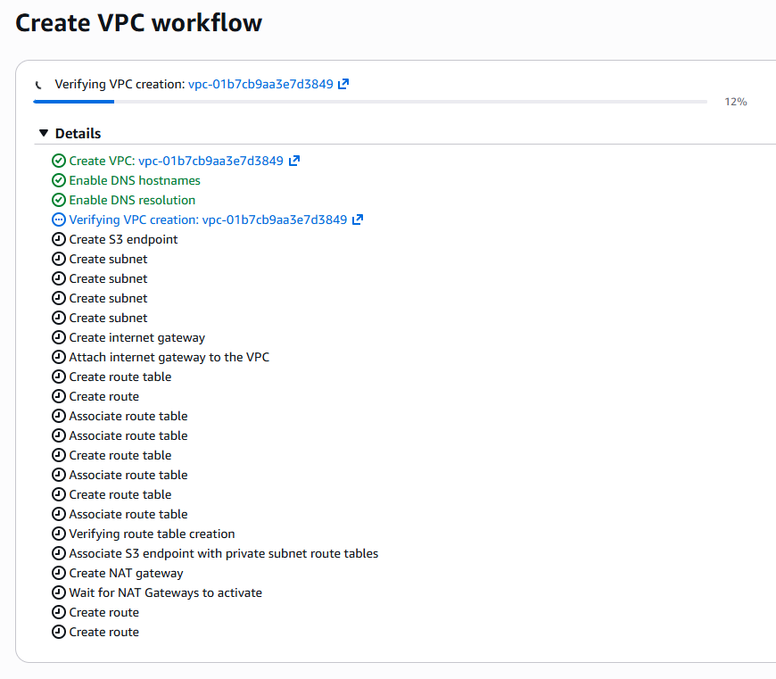  

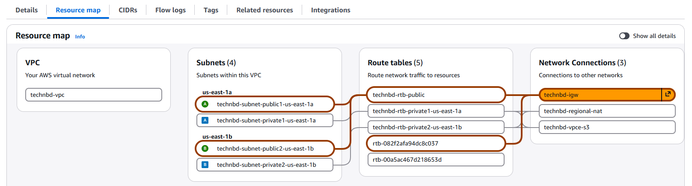  

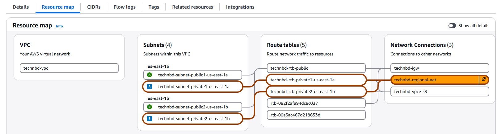


---
---


## Method B: `VPC only` (Manual Configuration)

### Step 1: Create VPC

1. Login to [AWS Console](https://us-east-1.console.aws.amazon.com/console/home?region=us-east-1) in the **us-east-1 (N. Virginia)** region.

2. Open the `VPC Dashboard` and click `Create VPC`: 

3. Under the `VPC settings` and `Resources to create`: 
    - Select ✅ `VPC only` option 
    - Name tag - optional: `technbd-vpc`
    - IPv4 CIDR block: select ✅ `IPv4 CIDR manual input`
    - IPv4 CIDR: `10.0.0.0/16`
    - IPv6 CIDR block: ✅ `No IPv6 CIDR block`
    - Tenancy: `Default` 
    - VPC encryption control ($): ✅ `None`
    - Tags:
        - Name: technbd-vpc
    - Click: `Create VPC`

4. Select your new VPC `technbd-vpc` - click `Actions` - click `Edit VPC settings`: 
    - DNS settings: 
        - ✅ Enable DNS resolution
        - ✅ Enable DNS hostnames   (<-- By default, custom VPCs do not automatically assign public DNS hostnames)
    - Click `Save`


### Step 2: Create Public Subnets:

1. In the left navigation pane, under `Virtual private cloud` - click `Subnets` - click `Create subnet`:
    - VPC: 
        - VPC ID: select VPC `technbd-vpc`
    - Subnet settings: (Create at least two subnets in different Availability Zones (AZs) for high availability)
    - **Subnet 1:** 
        - Subnet name: `public-subnet-1`
        - Availability Zone: `us-east-1a`
        - IPv4 VPC CIDR block: `10.0.0.0/16`
        - IPv4 subnet CIDR block: `10.0.1.0/24`
        - Tags - optional:
            - Name: `public-subnet-1`
    - **Subnet 2:** 
        - Subnet name: `public-subnet-2`
        - Availability Zone: `us-east-1b`
        - IPv4 VPC CIDR block: `10.0.0.0/16`
        - IPv4 subnet CIDR block: `10.0.2.0/24`
        - Tags - optional:
            - Name: `public-subnet-2`
    - Click `Create subnet`

2. Enable Public IPv4 Address: 
    - In the left navigation pane, under `Virtual private cloud` - click `Subnets` - click `public-subnet-1` - click `Actions` - click `Edit subnet settings`:
    - Auto-assign IP settings: ✅ `Enable auto-assign public IPv4 address`
    - Click `Save` (Do the same for: `public-subnet-2`)


_Public subnets are now:_
```
          technbd-vpc
          10.0.0.0/16
               |
       +-------+-------+
       |               |
   us-east-1a       us-east-1b
       |               |
10.0.1.0/24       10.0.2.0/24
 Public-1          Public-2
```


### Step 3: Create Private Subnets: 

1. In the left navigation pane, under `Virtual private cloud` - click `Subnets` - click `Create subnet`:
    - VPC: 
        - VPC ID: select VPC `technbd-vpc`
    - Subnet settings: (Create at least two subnets in different Availability Zones (AZs) for high availability)
    - **Subnet 1:** 
        - Subnet name: `private-subnet-1`
        - Availability Zone: `us-east-1a`
        - IPv4 VPC CIDR block: `10.0.0.0/16`
        - IPv4 subnet CIDR block: `10.0.11.0/24`
        - Tags - optional:
            - Name: `private-subnet-1`
    - **Subnet 2:** 
        - Subnet name: `private-subnet-2`
        - Availability Zone: `us-east-1b`
        - IPv4 VPC CIDR block: `10.0.0.0/16`
        - IPv4 subnet CIDR block: `10.0.12.0/24`
        - Tags - optional:
            - Name: `private-subnet-2`
    - Click `Create subnet`


_Private subnets are now:_
```
          technbd-vpc
          10.0.0.0/16
               |
       +-------+-------+
       |               |
   us-east-1a       us-east-1b
       |               |
10.0.11.0/24       10.0.12.0/24
 private-1          private-2
```


_Now your complete subnet layout is:_
| Subnet           | CIDR         | AZ         | Type    |
| ---------------- | ------------ | ---------- | ------- |
| public-subnet-1  | 10.0.1.0/24  | us-east-1a | Public  |
| public-subnet-2  | 10.0.2.0/24  | us-east-1b | Public  |
| private-subnet-1 | 10.0.11.0/24 | us-east-1a | Private |
| private-subnet-2 | 10.0.12.0/24 | us-east-1b | Private |


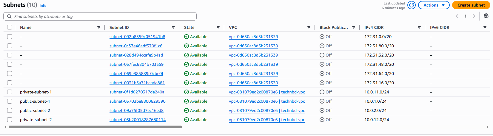


### Step 4: Create Internet Gateway 

If your instances require direct public internet access, create an IGW, attach it to your VPC, and add a route (0.0.0.0/0) pointing to the IGW in your public subnet's route table.


1. In the left navigation pane, under `Virtual private cloud` - click `Internet gateways` - click `Create internet gateway`:
    - Internet gateway settings: 
    - Name tag: `technbd-igw`
    - Tags - optional:
        - Name: `technbd-igw`
    - Click `Create internet gateway`

2. Then, select your new IGW `technbd-igw` - click `Actions` - click `Attach to VPC`:
    - VPC:
    - Available VPCs: select VPC `technbd-vpc`
    - Click `Attach internet gateway`


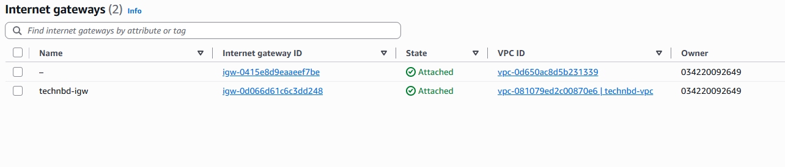


_You now have:_
```
Internet
    |
    v
Internet Gateway
    |
    v
   VPC (technbd-vpc)
```


### Step 5: Create Public Route Table 

1. In the left navigation pane, under `Virtual private cloud` - click `Route tables` - click `Create route table`:
    - Route table settings: 
    - Name - optional: `technbd-public-rt`
    - VPC: select VPC `technbd-vpc`
    - Tags
        - Name: `technbd-public-rt`
    - Click `Create route table`

2. Then **Add Internet Route**, select your new Route Table `technbd-public-rt` - click `Routes` Tab - click `Edit routes`:
    - Click `Add route` - select **Destination:** `0.0.0.0/0`
    - Select **Target:** `Internet Gateway` - select `technbd-igw`
    - Click `Save changes`


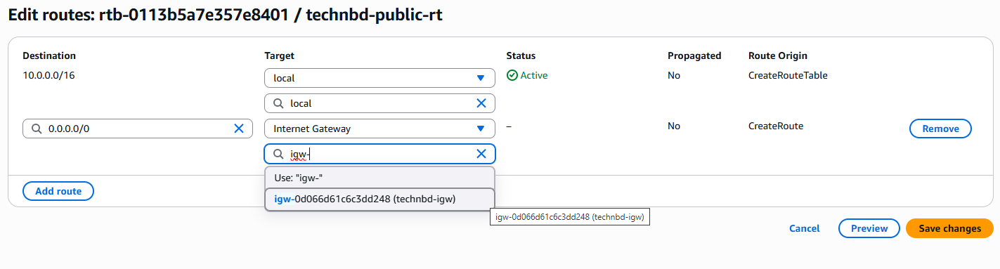

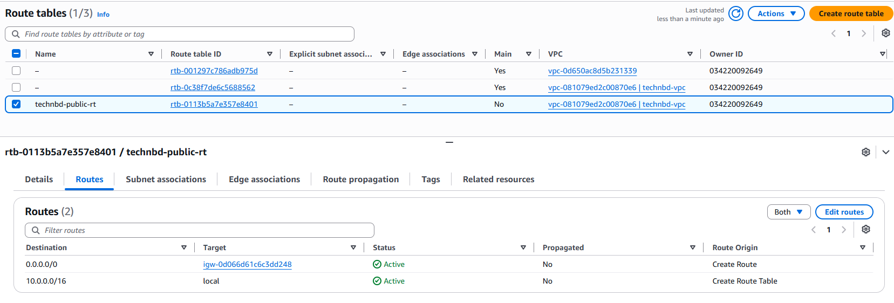


### Step 6: Associate Public Subnets 

1. Select your new Route Table `technbd-public-rt` - click `Subnet associations` Tab - click `Edit subnet associations`:
    - Select subnets: `public-subnet-1` and `public-subnet-2`
    - Click `Save associations`


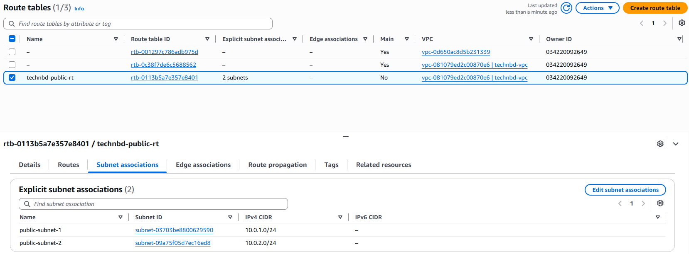


_Now:_
```
public-subnet-1 ─┐
                 ├── technbd-public-rt ──→ Internet Gateway
public-subnet-2 ─┘
```


---
---


### Create NAT Gateway:

A NAT Gateway allows private subnet resources to access the Internet, while preventing unsolicited Internet connections directly into those resources.

1. In the left navigation pane, under `Virtual private cloud` - click `NAT gateways` - click `Create NAT gateway`:
    - NAT gateway settings:
    - Name - optional: `technbd-nat-gw`
    - Availability mode: ✅ `Regional - new`
    - VPC: select VPC `technbd-vpc`
    - Connectivity type: ✅ `Public`
    - Method of Elastic IP (EIP) allocation: ✅ `Automatic`
    - Tags:
        - Name: technbd-nat-gw
    - Click `Create NAT gateway`


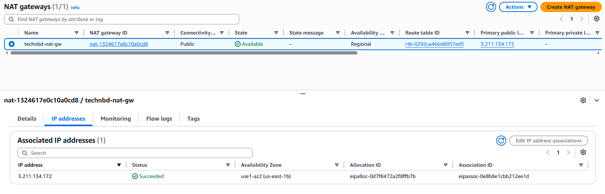


_Basic Flow:_
```
Private EC2
     |
     v
Private Route Table
     |
     v
NAT Gateway
     |
     v
Internet Gateway
     |
     v
Internet
```


### Create Private Route Table:

1. In the left navigation pane, under `Virtual private cloud` - click `Route tables` - click `Create route table`:
    - Route table settings: 
    - Name - optional: `technbd-private-rt`
    - VPC: select VPC `technbd-vpc`
    - Tags
        - Name: `technbd-private-rt`
    - Click `Create route table`

2. Then, **Add NAT Gateway Route**: select your new Route Table `technbd-private-rt` - click `Routes` Tab - click `Edit routes`:
    - Click `Add route` - select **Destination:** `0.0.0.0/0`
    - Select **Target:** `NAT Gateway` - select `technbd-nat-gw`
    - Click `Save changes`


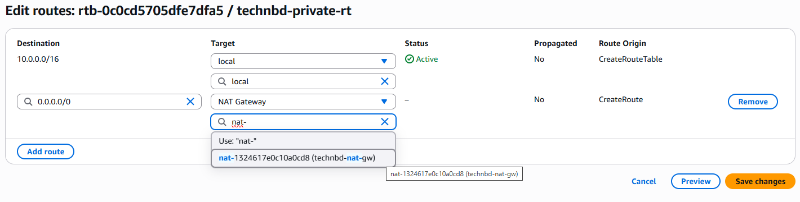

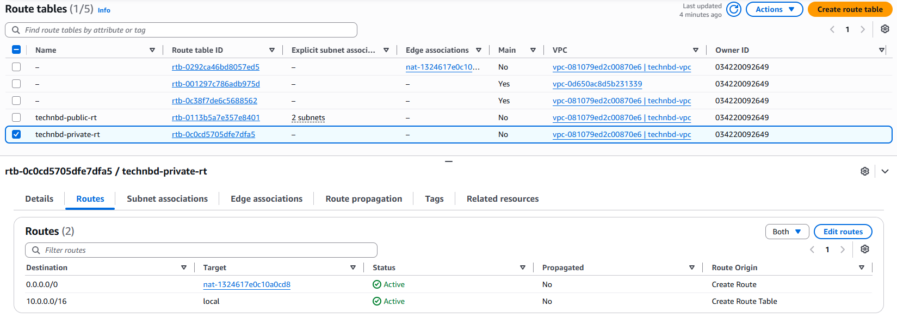


### Associate Private Subnets:

1. Select your new Route Table `technbd-private-rt` - click `Subnet associations` Tab - click `Edit subnet associations`:
    - Select subnets: `private-subnet-1` and `private-subnet-2`
    - Click `Save associations`


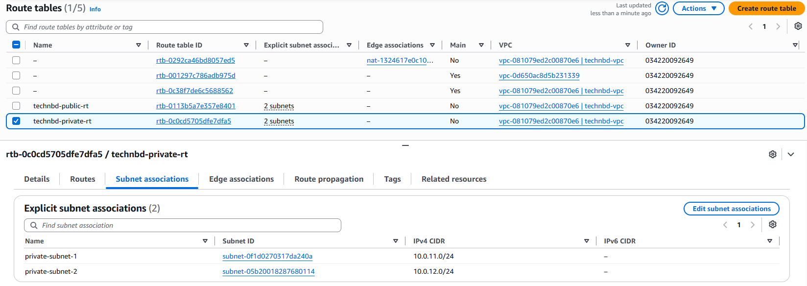


_Now:_
```
private-subnet-1 ─┐
                  ├── technbd-private-rt ──→ NAT Gateway
private-subnet-2 ─┘
```


#### Resource map:

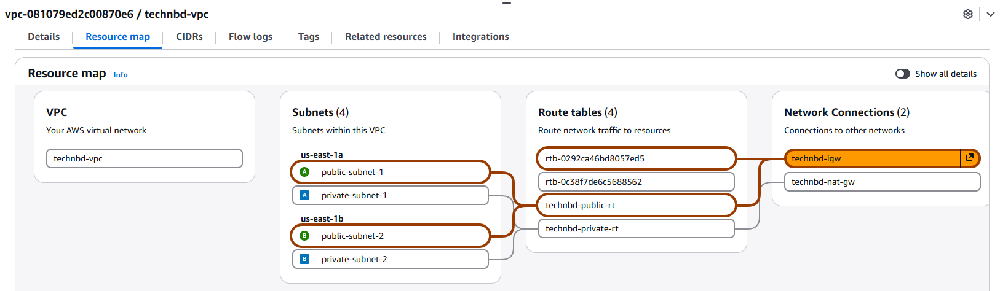

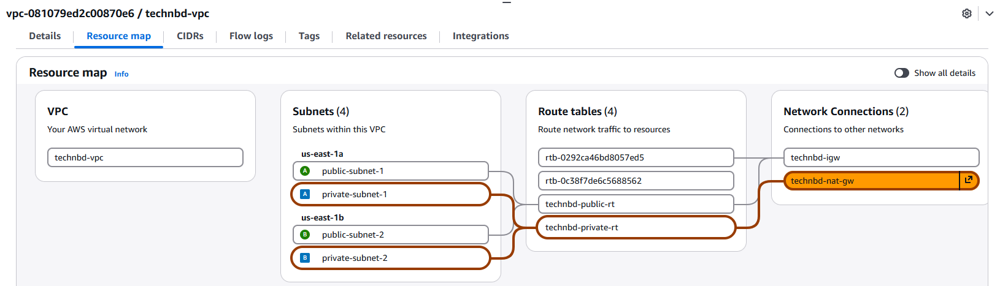


### Create Security Groups:

#### Public Web Security Group:
- Open the **VPC Console**.
    - Select `Security Groups` from the left menu under `Security` section, and click `Create security group`: 
        - Security group name: `public-web-sg`
        - Description: public-web-sg-for-technbd-vpc
        - VPC: select VPC `technbd-vpc`
        - **Inbound rules**:
            - Type:       HTTP 
            - Protocol:   TCP
            - Port:       80 
            - Source:     Anywhere IPv4 (0.0.0.0/0)
        - **Inbound rules**:
            - Type:       HTTPS 
            - Protocol:   TCP
            - Port:       443 
            - Source:     Anywhere IPv4 (0.0.0.0/0)
        - **Inbound rules**:
            - Type:       SSH 
            - Protocol:   TCP
            - Port:       22 
            - Source:     Anywhere IPv4 (0.0.0.0/0)
        - Click `Create security group` 


#### Private EC2 Security Group:

- Open the **VPC Console**.
    - Select `Security Groups` from the left menu under `Security` section, and click `Create security group`: 
        - Security group name: `private-app-sg`
        - Description: private-app-sg-for-technbd-vpc
        - VPC: select VPC `technbd-vpc`
        - **Inbound rules**:
            - Type:       `Custom TCP` 
            - Protocol:   TCP
            - Port:       8080 
            - Source:     `Custom`
                - **Security Groups**: select `public-web-sg`
        - **Inbound rules**:
            - Type:       SSH 
            - Protocol:   TCP
            - Port:       22 
            - Source:     Anywhere IPv4 (0.0.0.0/0)
        - **Inbound rules**:
            - Type:       `All ICMP - IPv4` 
            - Protocol:   `ICMP` 
            - Port:       `All`  
            - Source:     Anywhere IPv4 (0.0.0.0/0)
        - Click `Create security group` 


### How traffic works:

#### Public EC2 → Internet:


1. Launch your instance: 

2. Configure your instance:  
    - Number of instances: `1`
    - Name and tags: `web-server-01`
    - Amazon Machine Image (AMI): `Ubuntu Server 24.04 LTS` 
    - Instance type: `t3.micro` 
    - Key pair name (required): `technbd-key`
    - Network settings:
        - Network: select VPC `technbd-vpc`
        - Subnet: select subnet `public-subnet-1` 
        - Auto-assign public IP: `Enable`
        - Firewall (security groups): select existing security group (`public-web-sg`)
    - Configure storage: `1x 8 GiB - gp3` (Root volume,3000 IOPS, Not encrypted)
    - Advanced details: 
        - User data - optional: 
    - Then, `Launch instance`


```
EC2
 ↓
Public Route Table
 ↓
Internet Gateway
 ↓
Internet
```


#### Private EC2 → Internet


1. Launch your instance: 

2. Configure your instance:  
    - Number of instances: `1`
    - Name and tags: `web-server-02`
    - Amazon Machine Image (AMI): `Ubuntu Server 24.04 LTS` 
    - Instance type: `t3.micro` 
    - Key pair name (required): `technbd-key`
    - Network settings:
        - Network: select VPC `technbd-vpc`
        - Subnet: select subnet `private-subnet-1` or `private-subnet-2`
        - Auto-assign public IP: `Disable`
        - Firewall (security groups): select existing security group (`private-app-sg`)
    - Configure storage: `1x 8 GiB - gp3` (Root volume,3000 IOPS, Not encrypted)
    - Advanced details: 
        - User data - optional: 
    - Then, `Launch instance`


```
Private EC2
 ↓
Private Route Table
 ↓
NAT Gateway
 ↓
Internet Gateway
 ↓
Internet
```


### Final VPC Architecture:

- By default, all four subnets are internally reachable at the VPC routing level, because they are all inside `10.0.0.0/16`.

- The `10.0.0.0/16` → `local` route means resources in the VPC can communicate with other resources in the VPC without going through the **Internet Gateway** or **NAT Gateway**.


```
                           INTERNET
                               |
                               |
                       +---------------+
                       | Internet      |
                       | Gateway       |
                       +-------+-------+
                               |
                    +----------+----------+
                    |       VPC           |
                    |    10.0.0.0/16      |
                    |                     |
       AZ-A         |                     |         AZ-B
   us-east-1a       |                     |      us-east-1b
                    |                     |
 +------------------+---+             +---+------------------+
 | Public Subnet        |             | Public Subnet        |
 | 10.0.1.0/24          |             | 10.0.2.0/24          |
 |                      |             |                      |
 | ALB / NAT Gateway    |             | ALB                  |
 +----------+-----------+             +----------+-----------+
            |                                    |
            |                                    |
 +----------v-----------+             +----------v-----------+
 | Private Subnet       |             | Private Subnet       |
 | 10.0.11.0/24         |             | 10.0.12.0/24         |
 |                      |             |                      |
 | EC2 / Application    |             | EC2 / Application    |
 +----------------------+             +----------------------+
            |                                    |
            +----------------+-------------------+
                             |
                       Private Route
                             |
                        NAT Gateway
```


---
---


