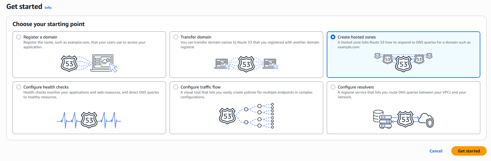
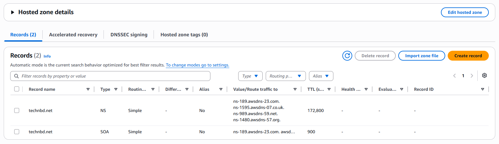
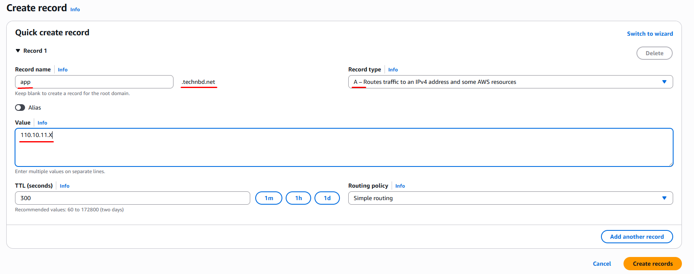

## AWS Route 53 Hosted Zone:

An AWS Route 53 Hosted Zone is a container in Route 53 that holds the DNS records for a domain. A Hosted Zone is basically the place in Route 53 where you manage the DNS records for your domain.


### Key Types of Hosted Zones:
- **Public Hosted Zones**: Used for DNS names that need to be resolved over the Internet.
- **Private Hosted Zones**: Used for DNS names that should be resolved inside one or more VPCs.


### Hosted Zone vs Domain:

These are **not the same thing.**


| Domain                             | Hosted Zone                     |
| ---------------------------------- | ------------------------------- |
| `example.com` is a domain          | DNS container for `example.com` |
| Can be registered with a registrar | Created in Route 53             |
| Represents ownership/registration  | Contains DNS records            |
| Can exist without Route 53         | Used to manage DNS in Route 53  |


### Important:

You **don't have to transfer your domain to AWS** to use a Route 53 **Hosted Zone**.


_You can have:_
```
Domain registered at:
Namecheap / GoDaddy / Cloudflare / etc.
              │
              ↓
       Route 53 Hosted Zone
              │
              ↓
         AWS resources
```

You simply configure the domain's NS (Name Server) records at your registrar to point to the Route 53 name servers.


---
---


## Setup Hosted zone:

Get started by registering a domain, configuring DNS, or using another Route 53 feature.


1. Open AWS Management Console and type `Route 53` in the top search bar and open the Route 53 dashboard and click `Get started` :


2. Choose your starting point:
    - Select `Create hosted zones` - click `Get started` :
    - Hosted zone configuration
        - Domain name: `technbd.net`
        - Description - optional: 
        - Type:
            - ✅ `Public hosted zone`  (<-- to route traffic on the internet)
        - Tags: 
        - Click `Create hosted zone`


  




3. Create DNS records: 
    - Click `Create record`
        - Record name (sub-domain): `app` 
        - Record type (A, CNAME, MX): `A - Routes traffic to an IPv4 address and some AWS resources`
        - Value: (your public ip)
        - TTL (seconds): 300 
    - Click `Create records`





---
---


